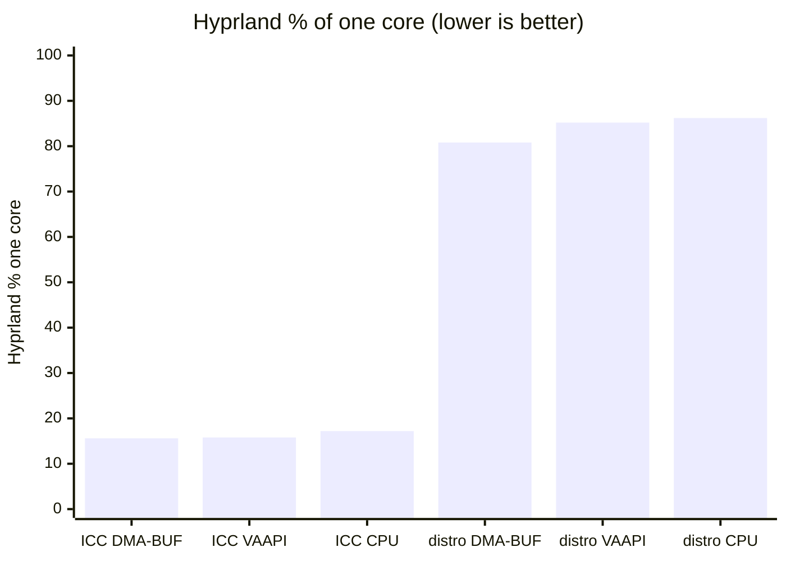
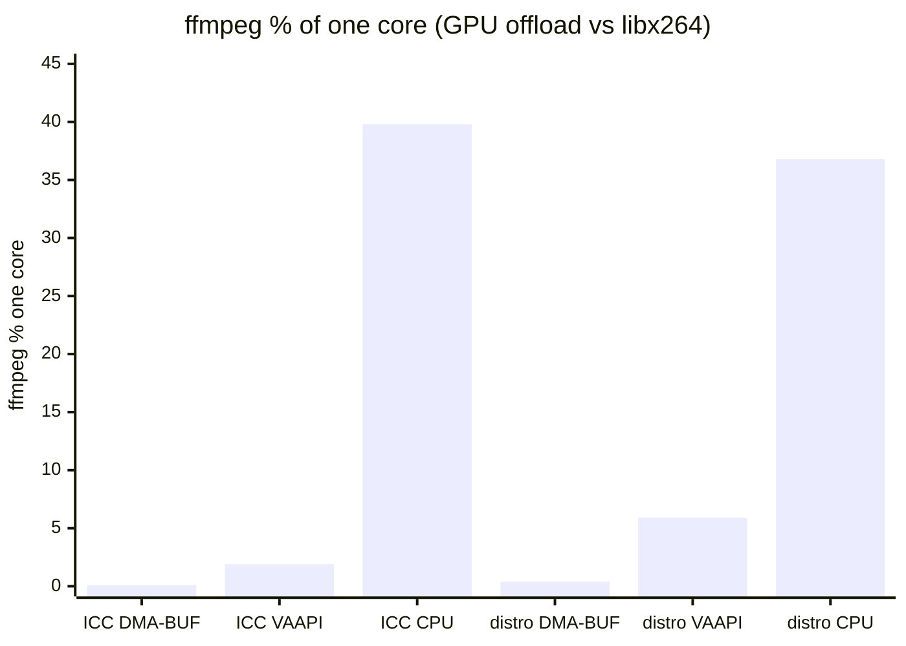

# Miracast capture / encode benchmarks

Live **Extend** session on Omarchy/Hyprland. These numbers motivate shipping
an ICC-capable `wf-recorder` (and keeping DMA-BUF as the default RENDER
ENGINE). Setup: [BUILD.md](BUILD.md).

## Capture binaries compared

| Label in tables/charts | Binary | Protocol | Notes |
|------------------------|--------|----------|--------|
| **Custom ICC** | `~/src/wf-recorder/build/wf-recorder` | `ext-image-copy-capture` | Local build of [ammen99/wf-recorder#347](https://github.com/ammen99/wf-recorder/pull/347) (`ext-copy-capture`) **plus** the Hyprland SIGINT teardown fix in **[soreau/wf-recorder#1](https://github.com/soreau/wf-recorder/pull/1)** (and FFmpeg 7.1+/9 dual-path from **[ammen99/wf-recorder#352](https://github.com/ammen99/wf-recorder/pull/352)** / [soreau#2](https://github.com/soreau/wf-recorder/pull/2) so it builds on Arch FFmpeg 9). |
| **Distro 0.6.0** | `/usr/bin/wf-recorder` | `wlr-screencopy` | Unmodified Arch package — baseline “what everyone gets today.” |

Both were measured in the same matrix. The low-Hyprland-CPU rows are the
**custom patched build**, not distro stock.

---

## Method

| Item | Value |
|------|--------|
| Date | 2026-09-12 |
| Host | Intel i7-1165G7 + Intel iGPU (VAAPI `/dev/dri/renderD128`) |
| Compositor | Hyprland 0.56.x |
| Session | Miracast Extend ≈1280×720@30, damage-aware capture |
| Custom ICC build | Path above; based on #347 + [#1](https://github.com/soreau/wf-recorder/pull/1) (+ FFmpeg dual-path) |
| Distro baseline | Arch `wf-recorder` **0.6.0** |
| Sample | 6 s warmup + **18 s** window |
| CPU metric | `%` of **one** core (`utime+stime` delta via `/proc`) |

**Axes**

1. **Capture binary / protocol** — custom ICC build vs distro wlr-screencopy  
2. **RENDER ENGINE** — `dmabuf` (GPU DMA-BUF) / `vaapi` (raw pipe → hwupload) / `cpu` (libx264)

GPU busy-% was not instrumented (no `intel_gpu_top` in the environment). Encode
offload is inferred from **ffmpeg CPU**: near-zero on DMA-BUF means the iGPU is
doing the heavy encode work.

Raw data: [`docs/benchmarks/results.tsv`](docs/benchmarks/results.tsv)
(column `capture`: `icc` = custom build, `stock` = distro `/usr/bin/wf-recorder`).

---

## Results (primary table)

| Case | Capture binary | RENDER ENGINE | Hyprland | wf-recorder | ffmpeg | Resolved path | Encoder |
|------|----------------|---------------|----------|-------------|--------|---------------|---------|
| **icc_dmabuf** | **Custom ICC** (#347 + [#1](https://github.com/soreau/wf-recorder/pull/1)) | DMA-BUF | **15.6%** | 0.7% | 0.1% | `dmabuf` | `h264_vaapi` |
| icc_vaapi | Custom ICC | VAAPI pipe | 15.8% | 1.4% | 1.9% | `pipe` | `h264_vaapi` |
| icc_cpu | Custom ICC | CPU | 17.2% | 1.7% | **39.8%** | `pipe` | `libx264` |
| stock_dmabuf | Distro 0.6.0 | DMA-BUF | **80.8%** | 2.4% | 0.4% | `dmabuf` | `h264_vaapi` |
| stock_vaapi | Distro 0.6.0 | VAAPI pipe | 85.2% | **14.3%** | 5.9% | `pipe` | `h264_vaapi` |
| stock_cpu | Distro 0.6.0 | CPU | 86.2% | 14.1% | **36.8%** | `pipe` | `libx264` |

### Takeaways

1. **Custom ICC vs distro dominates Hyprland CPU** — ~**15–17%** vs ~**81–86%**
   one-core, almost independent of RENDER ENGINE. That is the
   compositor/protocol win from #347 (+ reliable stop from [#1](https://github.com/soreau/wf-recorder/pull/1)).
2. **DMA-BUF is the cheap encode path** — ffmpeg ≈0% CPU; encode happens in
   `wf-recorder` via VAAPI DMA-BUF (iGPU). Prefer **GPU · DMA-BUF** in the panel.
3. **VAAPI pipe** keeps Hyprland low under the custom ICC build but moves pixels
   through a raw pipe; ffmpeg does `hwupload` (~2–6% CPU). Distro + pipe also
   inflates **wf-recorder** CPU (~14%).
4. **CPU (`libx264`)** costs ~**37–40%** ffmpeg on either binary — fine as
   fallback, not as default on battery.

---

## Charts

### Hyprland compositor cost (custom ICC vs distro)


Distro wlr-screencopy keeps Hyprland near a full core. The custom ICC build
cuts that by ~**5×**.

### Grouped CPU: Hyprland / wf-recorder / ffmpeg


### Stacked mix (same units, load shape)


### Encode offload (ffmpeg CPU)


DMA-BUF ≈ silent on the CPU encode side; libx264 is the spike.

### Mermaid (GitHub-native) — Hyprland only



### Mermaid — ffmpeg encode CPU



---

## How to read “GPU usage” here

| Path | Where encode runs | What you see on CPU |
|------|-------------------|---------------------|
| **DMA-BUF** | iGPU inside `wf-recorder` (`h264_vaapi` + DMA) | ffmpeg ≈0%; wf-recorder low |
| **VAAPI pipe** | iGPU after ffmpeg `hwupload` | ffmpeg a few %; more copies |
| **CPU** | host cores (`libx264`) | ffmpeg ~35–40% one core |

Without a GPU profiler, treat **low ffmpeg + `encoder=h264_vaapi` + `capturePath=dmabuf`**
as “GPU encode engaged.” Direct GT busy-% can be added later with
`intel_gpu_top -J` if desired.

---

## Recommended defaults (from this data)

| Knob | Recommendation | Why |
|------|----------------|-----|
| Capture binary | Custom ICC build via `wfRecorderBin` (until packaged) | ~5× less Hyprland CPU |
| Else | PATH distro `wf-recorder` | Works everywhere; accept high compositor CPU |
| RENDER ENGINE | **dmabuf** | Cheapest encode; quality via CQP |
| Fallback | vaapi → cpu | Automatic in FluxCast cascade |

Portable Omarchy default remains **PATH distro** until ICC is packaged; opt into
the patched build explicitly — see [BUILD.md](BUILD.md) and [README.md](README.md).

---

## Upstream PRs (this PoC)

| PR | Role in these benchmarks |
|----|--------------------------|
| [ammen99/wf-recorder#347](https://github.com/ammen99/wf-recorder/pull/347) | ICC / `ext-copy-capture` client (base of the custom build) |
| **[soreau/wf-recorder#1](https://github.com/soreau/wf-recorder/pull/1)** | Hyprland SIGINT teardown fix — required for stable stop on the custom build |
| **[ammen99/wf-recorder#352](https://github.com/ammen99/wf-recorder/pull/352)** / [soreau#2](https://github.com/soreau/wf-recorder/pull/2) | FFmpeg 7.1+/9 `avcodec_get_supported_config` dual-path — required to **build** on Arch FFmpeg 9 |

---

## Reproducing

```bash
# Script used for this run (adjust paths):
bash ~/.grok/long-running-background-tasks/miracast_encode_matrix_bench.sh
# Outputs: /tmp/wf-recorder-icc-ab/encode-matrix/results.tsv
```

Reconnect / settings restore is built into the script (returns to saved
`wfRecorderBin` + `captureEncode`).

---

## Related

- [BUILD.md](BUILD.md) — local ICC PoC setup  
- [README.md](README.md) — panel install / settings  
