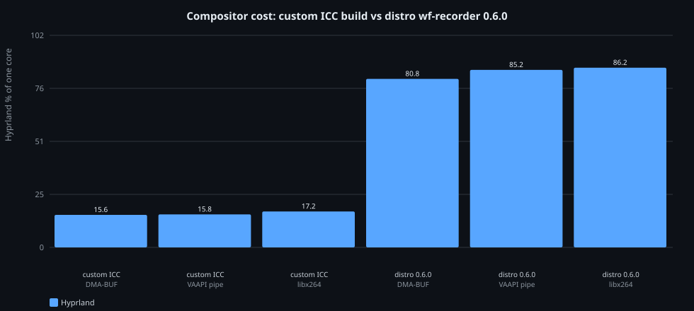
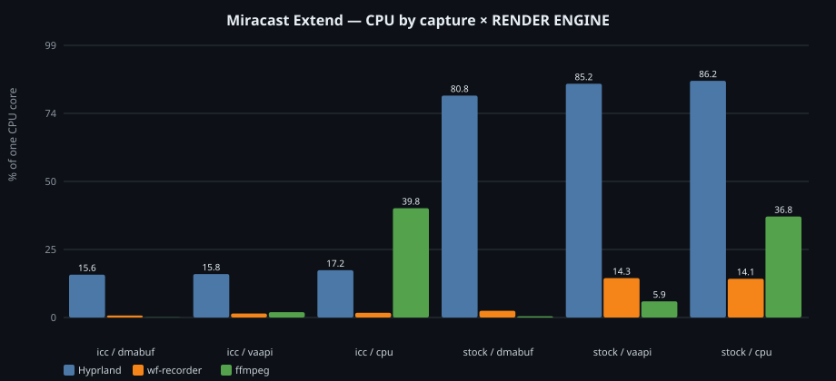
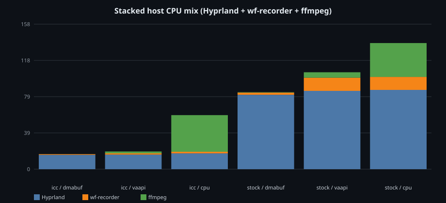
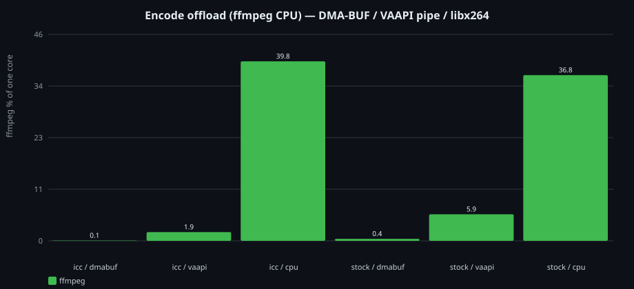
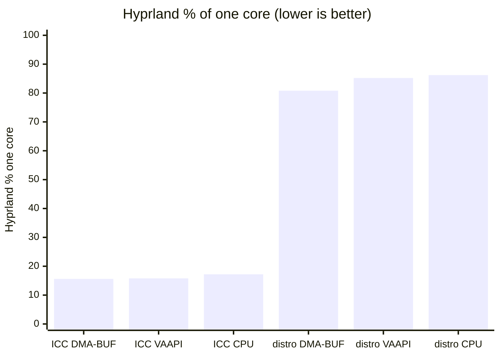
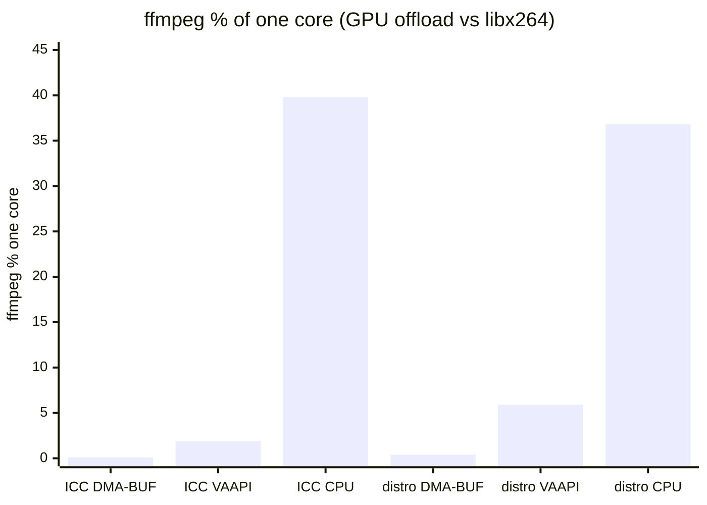

# Miracast capture / encode benchmarks

Live **Extend** session on Omarchy/Hyprland. These numbers motivate shipping
an ICC-capable `wf-recorder` (and keeping DMA-BUF as the default RENDER
ENGINE). Setup: [BUILD.md](BUILD.md).

**RF / P2P channel** (quiet-channel CSA / MCC vs SCC) is mostly orthogonal to
the encode CPU matrix below — it changes airtime contention on the radio.
Measured A/B: [docs/benchmarks/p2p_channel_ab.tsv](docs/benchmarks/p2p_channel_ab.tsv)
(see § P2P channel A/B). Setup notes: [BUILD.md](BUILD.md) § P2P quiet channel.

## Capture binaries compared

| Label in tables/charts | Binary | Protocol | Notes |
|------------------------|--------|----------|--------|
| **Custom ICC** | `~/src/wf-recorder/build/wf-recorder` | `ext-image-copy-capture` | Local build of [ammen99/wf-recorder#347](https://github.com/ammen99/wf-recorder/pull/347) (`ext-copy-capture`) **plus** the Hyprland SIGINT teardown fix in **[soreau/wf-recorder#1](https://github.com/soreau/wf-recorder/pull/1)** (and FFmpeg 7.1+/9 dual-path from **[ammen99/wf-recorder#352](https://github.com/ammen99/wf-recorder/pull/352)** / [soreau#2](https://github.com/soreau/wf-recorder/pull/2) so it builds on Arch FFmpeg 9). |
| **Distro 0.6.0** | `/usr/bin/wf-recorder` | `wlr-screencopy` | Unmodified Arch package — baseline “what everyone gets today.” |

Both were measured in the same matrix. The low-Hyprland-CPU rows are the
**custom patched build**, not distro stock.

---

## Method

| Item | Value |
|------|--------|
| Date | 2026-09-12 |
| Host | Intel i7-1165G7 + Intel iGPU (VAAPI `/dev/dri/renderD128`) |
| Compositor | Hyprland 0.56.x |
| Session | Miracast Extend ≈1280×720@30, damage-aware capture |
| Custom ICC build | Path above; based on #347 + [#1](https://github.com/soreau/wf-recorder/pull/1) (+ FFmpeg dual-path) |
| Distro baseline | Arch `wf-recorder` **0.6.0** |
| Sample | 6 s warmup + **18 s** window |
| CPU metric | `%` of **one** core (`utime+stime` delta via `/proc`) |

**Axes**

1. **Capture binary / protocol** — custom ICC build vs distro wlr-screencopy  
2. **RENDER ENGINE** — `dmabuf` (GPU DMA-BUF) / `vaapi` (raw pipe → hwupload) / `cpu` (libx264)

Encode offload in the primary matrix is inferred from **ffmpeg CPU**: near-zero
on DMA-BUF means the iGPU is doing the heavy encode work. A later **LPCM
cadence A/B** (below) also records Intel GT busy-% via `intel_gpu_top`.

Raw data: [`docs/benchmarks/results.tsv`](docs/benchmarks/results.tsv)
(column `capture`: `icc` = custom build, `stock` = distro `/usr/bin/wf-recorder`).

---

## Results (primary table)

| Case | Capture binary | RENDER ENGINE | Hyprland | wf-recorder | ffmpeg | Resolved path | Encoder |
|------|----------------|---------------|----------|-------------|--------|---------------|---------|
| **icc_dmabuf** | **Custom ICC** (#347 + [#1](https://github.com/soreau/wf-recorder/pull/1)) | DMA-BUF | **15.6%** | 0.7% | 0.1% | `dmabuf` | `h264_vaapi` |
| icc_vaapi | Custom ICC | VAAPI pipe | 15.8% | 1.4% | 1.9% | `pipe` | `h264_vaapi` |
| icc_cpu | Custom ICC | CPU | 17.2% | 1.7% | **39.8%** | `pipe` | `libx264` |
| stock_dmabuf | Distro 0.6.0 | DMA-BUF | **80.8%** | 2.4% | 0.4% | `dmabuf` | `h264_vaapi` |
| stock_vaapi | Distro 0.6.0 | VAAPI pipe | 85.2% | **14.3%** | 5.9% | `pipe` | `h264_vaapi` |
| stock_cpu | Distro 0.6.0 | CPU | 86.2% | 14.1% | **36.8%** | `pipe` | `libx264` |

### Takeaways

1. **Custom ICC vs distro dominates Hyprland CPU** — ~**15–17%** vs ~**81–86%**
   one-core, almost independent of RENDER ENGINE. That is the
   compositor/protocol win from #347 (+ reliable stop from [#1](https://github.com/soreau/wf-recorder/pull/1)).
2. **DMA-BUF is the cheap encode path** — ffmpeg ≈0% CPU; encode happens in
   `wf-recorder` via VAAPI DMA-BUF (iGPU). Prefer **GPU · DMA-BUF** in the panel.
3. **VAAPI pipe** keeps Hyprland low under the custom ICC build but moves pixels
   through a raw pipe; ffmpeg does `hwupload` (~2–6% CPU). Distro + pipe also
   inflates **wf-recorder** CPU (~14%).
4. **CPU (`libx264`)** costs ~**37–40%** ffmpeg on either binary — fine as
   fallback, not as default on battery.

---

## Charts

### Hyprland compositor cost (custom ICC vs distro)



Distro wlr-screencopy keeps Hyprland near a full core. The custom ICC build
cuts that by ~**5×**.

### Grouped CPU: Hyprland / wf-recorder / ffmpeg



### Stacked mix (same units, load shape)



### Encode offload (ffmpeg CPU)



DMA-BUF ≈ silent on the CPU encode side; libx264 is the spike.

### Mermaid (GitHub-native) — Hyprland only



### Mermaid — ffmpeg encode CPU



---

## How to read “GPU usage” here

| Path | Where encode runs | What you see on CPU |
|------|-------------------|---------------------|
| **DMA-BUF** | iGPU inside `wf-recorder` (`h264_vaapi` + DMA) | ffmpeg ≈0%; wf-recorder low |
| **VAAPI pipe** | iGPU after ffmpeg `hwupload` | ffmpeg a few %; more copies |
| **CPU** | host cores (`libx264`) | ffmpeg ~35–40% one core |

Treat **low ffmpeg + `encoder=h264_vaapi` + `capturePath=dmabuf`** as “GPU encode
engaged.” Direct GT busy-% for the LPCM cadence experiment is in the next
section (`intel_gpu_top`).

---

## LPCM cadence A/B: continuous `-D` vs damage-aware (2026-09-13)

Live **Extend** at **1920×1080p30**, custom ICC `wf-recorder`
(`fix/hyprland-sigint-teardown` / soreau#1 tip), LPCM path, VAAPI DMA-BUF encode.
Omarchy sets `FLUXCAST_WFD_WF_RECORDER_DAMAGE=1` by default; FluxCast LPCM now
honors that flag (omit `-D`). Previously LPCM always forced continuous `-D`.

| Item | Value |
|------|--------|
| Date | 2026-09-13 |
| Host | Same laptop (i7-1165G7 + Intel iGPU) |
| Binary | `~/src/wf-recorder/build/wf-recorder` `0.6.0-69d36d4` |
| Stream | `1920x1080p30`, LPCM mux, `-c h264_vaapi` |
| CPU sample | ~10×1 s `/proc` one-core % |
| GPU sample | `pkexec intel_gpu_top -l -s 1000 -n 13` (RCS=render, VCS=video/encode) |

| Case | Cadence | Hyprland | wf-recorder | fluxcast | RCS % | VCS % | GPU power W |
|------|---------|----------|-------------|----------|-------|-------|-------------|
| **lpcm_continuous_D** | `-D` (forced every tick) | 4.8% | 2.6% | 2.5% | **16.8** | 2.2 | 1.19 |
| **lpcm_damage_aware** | no `-D` (`DAMAGE=1`) | 7.0% | 3.2% | 2.9% | **16.6** | 1.9 | 0.99 |

Δ (damage-aware − continuous): RCS ≈ **−1%**, VCS **−12%**, GPU power **−17%**;
CPU did not improve in this window (Hyprland CPU rose — likely more desktop
activity in the second sample).

### Takeaways

1. **Damage-aware is on for LPCM** when Omarchy exports `DAMAGE=1` — confirm with
   `ps` (`-y -r 30` without `-D`).
2. Under a **busy/animating** Extend head, GT render load stays similar; expect a
   larger drop on a mostly static desktop.
3. With the Hyprland ICC present-schedule fix, damage-aware typing is usable; if
   keystrokes lag, force continuous with `FLUXCAST_WFD_WF_RECORDER_DAMAGE=0`.

Raw: [`docs/benchmarks/lpcm_damage_ab.tsv`](docs/benchmarks/lpcm_damage_ab.tsv),
JSON/IGT logs under [`docs/benchmarks/`](docs/benchmarks/).

---

## Auto-recommend cast profile

Score [`results.tsv`](docs/benchmarks/results.tsv) (and optional
[`lpcm_damage_ab.tsv`](docs/benchmarks/lpcm_damage_ab.tsv)) and pick the
lowest-cost **available** capture+encode combo on this machine:

```bash
# Dry-run: print winner + write docs/benchmarks/recommended.env
./scripts/recommend-cast-profile.py

# Apply into ~/.config/omarchy-miracast/settings.json (+ state recommended-cast.env)
./scripts/recommend-cast-profile.py --apply
```

Heuristics:

1. Prefer **ICC** rows when an ICC-capable `wf-recorder` exists (`--toplevel`);
   otherwise stock.
2. Minimize `hypr_cpu + 0.5·wf_cpu + ffmpeg_cpu` (small tie-break favoring
   **dmabuf** → vaapi → cpu).
3. Damage-aware (`wfRecorderDamage=1`) when the LPCM A/B shows GPU power/RCS
   not worse than continuous `-D` by much; else `0`.

`--apply` sets `captureEncode`, `videoEncoder`, `wfRecorderBin`,
`wfRecorderProto`, and `wfRecorderDamage`. The next Miracast connect exports
matching `FLUXCAST_WFD_*` env vars via `miracast-ctl`.

---

## Encode presets: desktop vs movie

| Preset | RC | Bitrate / QP | GOP | Damage | Best for |
|--------|-----|--------------|-----|--------|----------|
| **desktop** | CQP | qp 18 | 30 | damage-aware (`1`) | UI / terminals |
| **movie** | CQP | qp 18, quality 2 | 60 | continuous `-D` (`0`) | Fullscreen video (Intel CBR undershoots ≈3 Mbps → blocky) |

```bash
miracast-ctl set-cast-preset movie     # apply + restart capture if streaming
miracast-ctl set-cast-preset desktop
```

FluxCast reads `FLUXCAST_WFD_VAAPI_RC`, `FLUXCAST_WFD_VAAPI_BITRATE`,
`FLUXCAST_WFD_VAAPI_QP`, `FLUXCAST_WFD_VAAPI_GOP`, `FLUXCAST_WFD_VAAPI_QUALITY`.

**Intel CBR note (2026-09-13):** with `rc_mode=CBR` and `b=20M`/`28M`, P2P TX
stayed ~3 Mbps → smooth but blocky on action. Movie preset therefore stays on
**CQP**. FluxCast also auto-rebinds capture when `buffer pool full` / DTS errors
spike (recovery, not a cure for scale 1.6 load).

---

## P2P channel A/B (SCC vs quiet-channel CSA)

Live Extend. Equipment is **probed at bench time** by
`scripts/bench_host_info.py` (CPU/GPU/Wi‑Fi chip+driver, monitor display
names, sink display name). **Not logged:** Wi‑Fi SSID/BSSID or MAC addresses.

From the checked-in run (`docs/benchmarks/p2p_channel_ab.json`): Intel
i7-1165G7, Iris Xe, Wi‑Fi 6 AX201/`iwlwifi`, Hyprland; STA link **ch 44 @
80 MHz**; sink display name as advertised by the dongle.

**SCC**: `MIRACAST_SKIP_P2P_CSA=1` (GO remains on 44). **MCC**: post-PLAY CSA to
quiet off-block channel (**161**). Sample **20 s** after **6 s** settle; TX from
`/sys/class/net/<p2p-GO>/statistics`.

| Case | STA ch | GO ch | TX kbps | Signal | iw TX bitrate | Authorized |
|------|--------|-------|---------|--------|---------------|------------|
| **scc** | 44 | 44 | 6347.6 | −41 dBm | 72.2 Mb/s | yes |
| **mcc** | 44 | 161 | 6548.3 | −52 dBm | 72.2 Mb/s | yes |

MCC kept similar TX throughput while moving P2P off the STA’s 80 MHz block
(signal a bit weaker on 161, as expected). Home Wi‑Fi default route stayed up.

```bash
./scripts/bench_host_info.py                   # equipment JSON only
./scripts/bench_p2p_channel.sh                 # SCC vs MCC + equipment → docs/benchmarks/
./scripts/test_p2p_channel_integration.sh      # assert GO ch != STA ch after PLAY
```

Artifacts: `docs/benchmarks/public/p2p_channel_ab.*` (and legacy copies at `docs/benchmarks/p2p_channel_ab.*`). Full sink name/MAC dumps go to `docs/benchmarks/private/` (gitignored); run `./scripts/sanitize_benchmark_results.py` before PRs.

---

## Quality criteria (lightweight)

Benchmarks do **not** score perceptual video quality (no VMAF/SSIM/blockiness
meters). They do record **delivery / radio** health via
`scripts/quality_snapshot.py`:

| Check | Pass | Warn | Fail |
|-------|------|------|------|
| P2P signal | ≥ −70 dBm | −80…−70 dBm | < −80 dBm |
| Delivery errors | no capture restart / hard RTP errors in window | capture restart(s) | hard errors (`buffer pool`, DTS, RTP unhealthy) |
| TX stability | health TX delta CV ≤ 0.5 | CV ≤ 1.0 | CV > 1.0 or no TX |
| P2P TX bitrate (soft) | ≥ 150 Mb/s | 50–150 Mb/s | < 50 Mb/s |

Overall row grade is the worst check (`pass` < `warn` < `fail`). Encode
presets still rely on the subjective notes above (e.g. Intel CBR “blocky on
action”) until a heavier reference pipeline exists.

## Crowdsourced device results

Full local runs (sink **name + MAC**, WPS/P2P peer fields, Wi‑Fi SSIDs/BSSIDs,
raw `iw`) are written under **`docs/benchmarks/private/`** (gitignored). Device
identity prefers ``wpa_cli p2p_peer`` (manufacturer / model_name / device_name),
then RTSP ``sink-modes.json``, then name heuristics — see
``scripts/fingerprint_miracast_sink.py``. Before opening a PR, sanitize:

```bash
./scripts/record_live_benchmark.py          # while casting (optional stem)
# or: ./scripts/bench_p2p_channel.sh
./scripts/sanitize_benchmark_results.py     # → docs/benchmarks/public/ + table below
```

Public rows keep manufacturer/model hints, host CPU/GPU/Wi‑Fi chipset, session
metrics, and **radio/negotiation** details (STA/P2P channel, MHz width, MCC/SCC,
P2P role, signal dBm, negotiated bitrates, TX sample) — never MACs, SSIDs,
BSSIDs, or `$HOME` paths.

<!-- crowdsource-benchmarks:begin -->
<!-- Generated by scripts/sanitize_benchmark_results.py — do not edit by hand. -->

| Date | Sink (mfr / model) | Stream | Capture | Hyprland % | P2P TX kbps | Radio (ch/bw/MCC/role/signal) | Quality | Host CPU | Wi‑Fi driver | Kind |
| --- | --- | --- | --- | --- | --- | --- | --- | --- | --- | --- |
| 2026-09-14 | LG / SM8600PUA | 1920x1080p30 | dmabuf/h264_vaapi | 5.83 | 11803.9 | STA 44@80MHz; P2P 149@80MHz; MCC; P2P-client; -49 dBm; 866.7 Mb/s | pass | 11th Gen Intel(R) Core(TM) i7-1165G7 @ … | iwlwifi | live_session |

Private full dumps (name, MAC, SSIDs) live in `docs/benchmarks/private/` (gitignored). Contributors: run a bench, then `./scripts/sanitize_benchmark_results.py` and PR the updated `docs/benchmarks/public/` files plus this table.

**Quality** is lightweight delivery/radio criteria (`pass`/`warn`/`fail`) from `scripts/quality_snapshot.py` — signal floors, capture restarts, TX stability — **not** perceptual scores (no VMAF/SSIM).
<!-- crowdsource-benchmarks:end -->

---

## Recommended defaults (from this data)

| Knob | Recommendation | Why |
|------|----------------|-----|
| Capture binary | Custom ICC build via `wfRecorderBin` (until packaged) | ~5× less Hyprland CPU |
| Else | PATH distro `wf-recorder` | Works everywhere; accept high compositor CPU |
| RENDER ENGINE | **dmabuf** | Cheapest encode; quality via CQP |
| Fallback | vaapi → cpu | Automatic in FluxCast cascade |

Portable Omarchy default remains **PATH distro** until ICC is packaged; opt into
the patched build explicitly — see [BUILD.md](BUILD.md) and [README.md](README.md).

---

## Upstream PRs (this PoC)

| PR | Role in these benchmarks |
|----|--------------------------|
| [ammen99/wf-recorder#347](https://github.com/ammen99/wf-recorder/pull/347) | ICC / `ext-copy-capture` client (base of the custom build) |
| **[soreau/wf-recorder#1](https://github.com/soreau/wf-recorder/pull/1)** | Hyprland SIGINT teardown fix — required for stable stop on the custom build |
| **[ammen99/wf-recorder#352](https://github.com/ammen99/wf-recorder/pull/352)** / [soreau#2](https://github.com/soreau/wf-recorder/pull/2) | FFmpeg 7.1+/9 `avcodec_get_supported_config` dual-path — required to **build** on Arch FFmpeg 9 |

---

## Reproducing

```bash
# Encode matrix (historical run):
bash ~/.grok/long-running-background-tasks/miracast_encode_matrix_bench.sh
# Outputs: /tmp/wf-recorder-icc-ab/encode-matrix/results.tsv

# P2P channel A/B (SCC vs CSA):
./scripts/bench_p2p_channel.sh
# Outputs: docs/benchmarks/p2p_channel_ab.tsv / .json
```

Reconnect / settings restore is built into the encode script (returns to saved
`wfRecorderBin` + `captureEncode`). The P2P bench leaves the session on MCC.

---

## Related

- [BUILD.md](BUILD.md) — local ICC PoC setup  
- [README.md](README.md) — panel install / settings  
